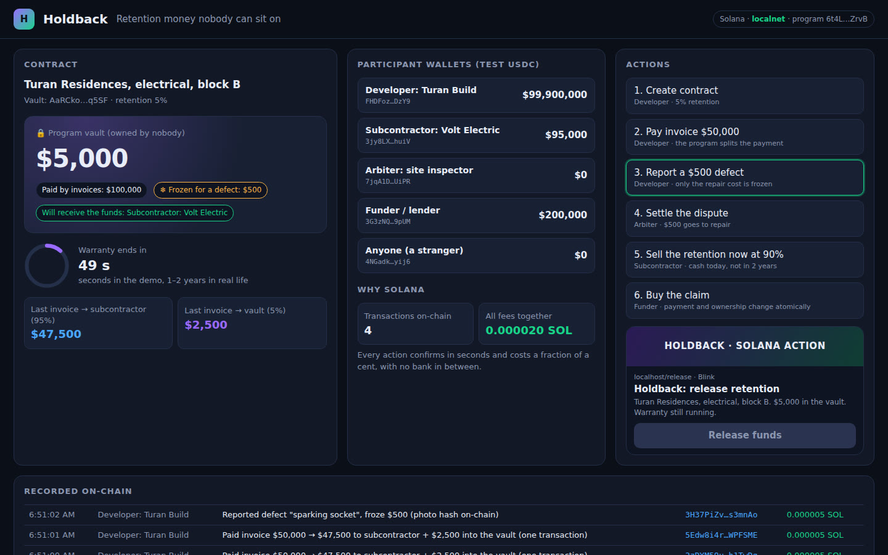

# Holdback — Retention Money Nobody Can Sit On

[](https://github.com/facei7505-droid/HOLD-BACK/actions/workflows/ci.yml)
[](LICENSE)
[](https://explorer.solana.com/address/F3qhQqGxVpjDPndPx4KhwoAdvxbmUchQotYFe8zWxARt?cluster=devnet)
[](https://www.anchor-lang.com)
[](https://colosseum.org)

> A Solana program that holds construction retention in a vault with no private key: 95% of every payment goes to the subcontractor at once, 5% is locked until the warranty ends, only the cost of a real defect can be frozen, the locked claim can be sold for cash today, and **anyone** can release the money when the warranty is over.

[Live Site](https://holdback-gamma.vercel.app) · [Live Demo (Phantom on devnet)](https://holdback-gamma.vercel.app/demo.html) · [Pitch Deck](https://holdback-gamma.vercel.app/deck.html) · [Video Walkthrough](media/holdback-demo.mp4) · [Docs](docs/) · [Program on Explorer](https://explorer.solana.com/address/F3qhQqGxVpjDPndPx4KhwoAdvxbmUchQotYFe8zWxARt?cluster=devnet)

---



---

## Submission to Solana Create Shymkent 2026 / Colosseum

Built during the Solana Create Shymkent bootcamp (Superteam Kazakhstan, Sep 28 – Oct 2, 2026).

| Name | Role | Contact |
|------|------|---------|
| Maga | Founder & Engineer | [GitHub](https://github.com/facei7505-droid) |

---

## Problem and Solution

In construction a client keeps 5–10% of every payment "as a warranty" for 1–2 years. That money sits in the client's own account.

### 1. Retention is delayed or never paid
- **Problem:** Almost £8 bn of cash retentions went unpaid over 3 years in England, mostly SME money ([Gowling WLG, 2025](https://gowlingwlg.com/insights-resources/articles/2025/construction-retentions-explained)). 43% of US subcontractors wait over 90 days for final payment and retainage ([Siteline, 2026](https://www.contractormag.com/management/news/55403190/subcontractors-are-still-financing-their-own-jobs-2026-survey-finds)).
- **Holdback:** After the warranty date **anyone** can call `release`; no reminders, no permission from the client.

### 2. Retention is lost when the client goes bankrupt
- **Problem:** 44% of contractors lost retention to an upstream insolvency, £27,300 per contract on average ([Fenwick Elliott](https://www.fenwickelliott.com/knowledge-hub/annual-review/ar-2019/is-it-time-to-release-retention-as-we-know-it/)).
- **Holdback:** Retention lands in a vault owned by a program address, not in the client's account. Nobody holds a key to it. (Legal treatment in a bankruptcy is still unproven, see [LEGAL.md](docs/LEGAL.md).)

### 3. One defect freezes the whole retention
- **Problem:** A small defect becomes a reason to hold back everything.
- **Holdback:** The client freezes **only the cost of the defect** (with an evidence hash); a neutral arbiter settles it; a silent arbiter cannot block the release after the arbiter window.

### 4. Subcontractors finance the job themselves
- **Problem:** 92% of US subcontractors floated payroll while waiting for money they had already earned.
- **Holdback:** The locked claim can be sold to a funder in one atomic transaction: the subcontractor gets cash today, the funder becomes the beneficiary.

Regulation is moving the same way: New Zealand requires retention in trust since 2023, and the UK decided to ban cash retentions (not before 2027).

---

## Why Solana

- **Cost:** a progress payment with a split costs a fraction of a cent, so even small invoices can go through the vault
- **Speed:** ~400 ms blocks and fast finality make the payment split feel like a normal bank transfer
- **Stablecoins:** USDC and local stablecoins (KZTE) live on SPL Token / Token-2022, which the program supports through `token_interface`
- **Blinks:** `release` is exposed as a Solana Action, so anyone can release funds from a link, without our app

---

## Summary of Features

- Atomic payment split: 95% to the subcontractor, 5% into a PDA-owned vault, in one transaction
- Three-party contract (client, subcontractor, arbiter) that the subcontractor must accept before any payment
- Partial freeze of a defect amount with an evidence hash, arbiter decides
- Arbiter window: an unsettled defect stops blocking release after a deadline
- Claim market: list the locked retention, buy it atomically, with price and vault-balance slippage guards
- Permissionless `release` after the warranty, also as a Blink
- SPL Token and Token-2022 support; mints with fee, hook, delegate or pause extensions are refused
- Web demo with a full simulation and a real devnet mode signed with Phantom

---

## Tech Stack

| Layer | Technology |
|-------|-----------|
| On-chain program | Rust · Anchor 0.31.1 · SPL Token / Token-2022 (`token_interface`) |
| Client | TypeScript / JavaScript · @coral-xyz/anchor · @solana/web3.js · @solana/spl-token |
| Website | Static HTML/CSS/JS on Vercel · esbuild bundle for the devnet client · Phantom |
| Demo server | Node.js (`http`), Solana Actions / Blink endpoint |
| Testing | ts-mocha · chai · solana-test-validator (22 tests) |
| CI | GitHub Actions: builds the program with `cargo-build-sbf` and runs all tests on a local validator |

---

## Architecture

```
  Client (developer)        Subcontractor          Arbiter            Funder           Anyone
        │                        │                    │                  │                 │
        │ create_contract        │ accept_contract    │ resolve_defect   │ buy_claim       │ release
        │ pay_progress           │ list_claim         │                  │                 │ (or Blink)
        │ raise_defect           │                    │                  │                 │
        ▼                        ▼                    ▼                  ▼                 ▼
 ┌────────────────────────────────────────────────────────────────────────────────────────────┐
 │                         Holdback program (Anchor, Solana)                                  │
 │                                                                                            │
 │   Contract PDA  ["contract", client, contract_id]                                          │
 │   client · subcontractor · arbiter · beneficiary · mint · retention_bps · warranty_end     │
 │   retained · frozen · released · ask_price · status (Proposed → Active → Released)         │
 │                                                                                            │
 │   Vault = associated token account owned by the Contract PDA (no private key)              │
 └────────────────────────────────────────────────────────────────────────────────────────────┘
        │ pay_progress: 95% ───────────────▶ subcontractor token account
        │               5% ───────────────▶ vault
        │ release (after warranty) vault ──▶ beneficiary (subcontractor or the funder who bought the claim)
```

See [docs/architecture.md](docs/architecture.md) for the account model, state machine and security checks, and [docs/api.md](docs/api.md) for every instruction and HTTP endpoint.

---

## Quick Start

**Prerequisites:** Node.js 22, Rust, Solana CLI 2.3 (Agave). Anchor CLI 0.31.1 is only needed to regenerate the IDL.

```bash
# Clone the repository
git clone https://github.com/facei7505-droid/HOLD-BACK
cd HOLD-BACK

# Install dependencies
npm install

# Environment variables for the demo server
cp .env.example .env

# Build the Solana program (target/deploy/holdback.so)
(cd programs/holdback && cargo-build-sbf)

# Start a local validator with the program loaded at its declared id
solana-test-validator --reset \
  --bpf-program F3qhQqGxVpjDPndPx4KhwoAdvxbmUchQotYFe8zWxARt target/deploy/holdback.so

# Run the tests (second terminal)
solana-keygen new --no-bip39-passphrase -o ~/.config/solana/id.json   # skip if you have a wallet
ANCHOR_PROVIDER_URL=http://127.0.0.1:8899 ANCHOR_WALLET=~/.config/solana/id.json npm test

# Start the local demo UI on http://localhost:3000 (reads .env)
npm run demo
```

To deploy under your own program id (`anchor keys sync`), devnet steps and using devnet USDC, see [docs/DEVNET.md](docs/DEVNET.md). If `cargo-build-sbf` fails on `blake3` with an older toolchain, run `cargo update -p blake3 --precise 1.5.5`.

---

## Repository Layout

| Path | What |
|---|---|
| `programs/holdback/src/lib.rs` | Anchor program, 8 instructions |
| `tests/` | 22 tests against a local validator (main flow, edge cases, hardening) |
| `app/` | Local demo server and UI (role wallets, vault, timer, on-chain log, Blink), devnet browser client source |
| `site/` | Product site on Vercel: landing, live simulation and Phantom devnet demo (`demo.html`), standalone deck |
| `deck/` | Pitch deck (source, HTML, PDF, 14 slides) |
| `media/` | Demo and pitch videos, recording scripts, narration text |
| `docs/` | Product, architecture, API, roadmap, business, legal, security and devnet notes |
| `target/idl/`, `target/types/` | Program IDL and TypeScript types |

---

## Roadmap

- [x] Anchor program: payment split, partial defect freeze, arbiter, claim market, permissionless release
- [x] Hardening: subcontractor acceptance, arbiter window, buyer guard, unsafe-mint guard (22 tests)
- [x] Deployed on Solana devnet, web demo signed with Phantom
- [x] Solana Action (Blink) for `release`
- [ ] Customer interviews and a pilot with a Kazakhstan contractor
- [ ] Protocol fee and multisig upgrade authority
- [ ] Independent security audit
- [ ] Mainnet with USDC / KZTE

Full roadmap: [docs/roadmap.md](docs/roadmap.md)

---

## Honest Limitations

- **Not audited.** Self-review only ([threat model](docs/THREAT-MODEL.md)); do not use real money. The upgrade authority must move to a multisig or be removed first.
- Devnet only, with a test token standing in for USDC / KZTE.
- Whether a court would respect the vault in a bankruptcy is untested ([legal notes](docs/LEGAL.md)).
- No fee mechanism in the program yet ([business model](docs/BUSINESS-MODEL.md)).
- In the devnet demo your Phantom wallet plays the client; the other roles are throwaway browser keypairs. The local demo server signs for every role.
- One open defect at a time, one arbiter per contract.
- No customer interviews yet; demand is unproven ([scorecard](docs/SCORECARD.md)).

---

## Resources

- [Live Site](https://holdback-gamma.vercel.app)
- [Live Demo on devnet](https://holdback-gamma.vercel.app/demo.html)
- [Pitch Deck (web)](https://holdback-gamma.vercel.app/deck.html) · [PDF](deck/holdback-pitch.pdf)
- [Demo Video (1:32)](media/holdback-demo.mp4) · [Pitch Video (2:04)](media/holdback-pitch.mp4)
- [Mentor Q&A](docs/MENTOR-QA.md) · [Scorecard](docs/SCORECARD.md)

---

## Contributing

See [CONTRIBUTING.md](CONTRIBUTING.md).

## License

MIT — see [LICENSE](LICENSE)
